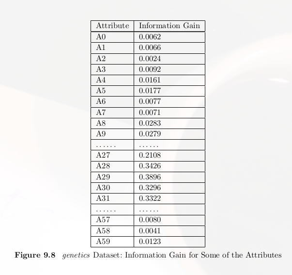
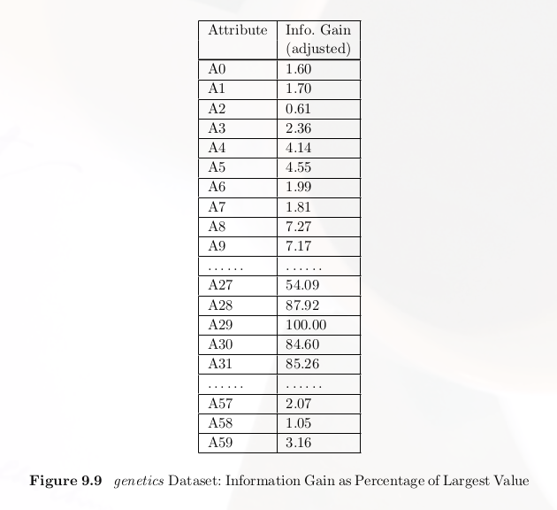
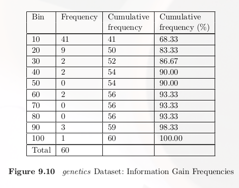

# Feature Reduction

在實務應用中，很常會遇到attritube太多，以至於分類結果的效果不佳之外，也會增加額外的運算量。所以進行適度的Feature Reduction是有其必要性的。

## Method 1：Feature Reduction with Information Gain
課本中所提到的方法。這個方式是先計算每個attritube的Information Gain，接著將所有attritube的Information Gain除於擁有最高Information Gain的attritube，因此可以得到一個比率，

所有attritube的Information Gain

 

調整過後的Information Gain

 

接著統計這些數據，進而做成一個Frequency Table

 

最後可以根據不同的方式挑選，想繼續留存的attritube，可以是留值最大的50個，也可以是比率大過0.5的屬性，看使用者如何去做篩選。

