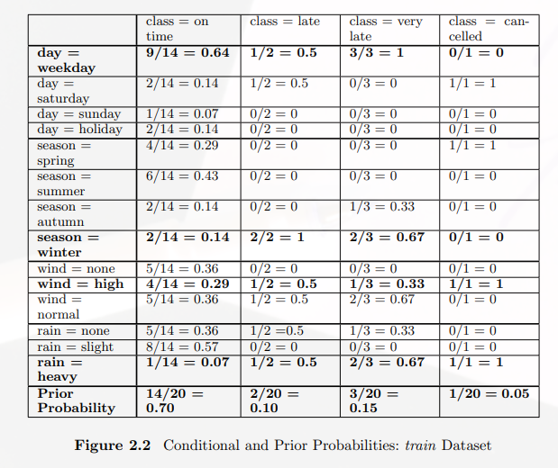

# Navie Bayes
這個演算法是基於 __機率__ 來進行分類，並由以下例子進行說明

 

## 用Class的類別中出現的機率來進行分類
如果用最簡單的方式說明用機率來分類，肯定是只用Class的類別中出現的機率來進行分類，以上的例子中

$$ P(on time) =  \frac{14}{20}=0.7 $$

$$ P(late) =  \frac{2}{20}=0.1 $$

$$ P(very late) =  \frac{3}{20}=0.15 $$
$$ P(cancelled) =  \frac{1}{20}=0.05 $$

因爲`on time`出現的機率最高，如果有一筆資料要我們進行分類，我們會直接將其歸類爲__on time__。但是使用這種方式進行分類有個很大的問題，就是沒辦法針對每一筆資料所擁有的屬性資料進行分類，所以幾乎只能說是瞎猜，毫無資料探勘的意義。

## 根據擁有的屬性資料進行分類

### 利用一個屬性資料進行分類舉例 
假設有筆資料要進行分類如下：
 

由於要參考所擁有的屬性資料進行分類，所以在這個演算法中，會利用條件機率的概念進行分類，首先我們先只看`rain`這個屬性，其餘先忽略，以上的例子中如果進行條件機率進行分類，會有以下的結果：

$$ P(class = on time | rain = heavy) = \frac{ \frac{1}{20} }{ \frac{5}{20}}=0.2$$

$$ P(class = late | rain = heavy) = \frac{1}{5}=0.2$$

$$ P(class = very late | rain = heavy) = \frac{2}{5}=0.4$$

$$ P(class = cancelled | rain = heavy) = \frac{1}{5}=0.2$$

如果有以上這樣的結果，則我們會將此筆資料歸類爲 __very late__ ，而不是 __on time__ ，因此利用這種方式我們在進行分類的同時就比較有個依據，不會像先前的分類方式如此糟糕。

### 利用多個屬性資料進行分類 

所以如果我們要利用多個屬性資料進行分類時，我們可以利用這種 __事後機率__ 的方式進行，如果以剛剛要進行分類的例子說明的話就是找出以下的機率

$$ P(class = on time | weekday \cap winter \cap high \cap heavy) = ?$$

$$ P(class = late | weekday \cap winter \cap high \cap heavy) = ?$$

$$ P(class = very late | weekday \cap winter \cap high \cap heavy) = ?$$

$$ P(class = cancelled | weekday \cap winter \cap high \cap heavy) = ?$$

#### 式子推導
要找出以上的式子可以用以下這種方式：

$$ P(C|a_1,a_2,....,a_n) = \frac{P(C)P(a_1,a_2,....,a_n|C)}{P(a_1,a_2,....,a_n)}$$

但實際上，我們只關心分子的部分

$$P(C,a_1,a_2,....,a_n)$$

也因爲

$$P(C,a_1,a_2,....,a_n) $$ 

$$ \propto P(C)P(a_1,a_2,....,a_n|C)$$

$$\propto P(C)P(a_1|C)P(a_2,....a_n|C,a_1)$$

$$\propto P(C)P(a_1|C)P(a_2|C,a_1)P(a_3|C,a_1,a_2,a_3)...P(a_n|C,a_1,a_2,...a_n)$$

最後因爲$$a_1,a_2,....a_n$$之間彼此互相獨立

$$P(a_2|C,a_1) = P(a_2|C)$$

所以可以得到

$$P(C)P(a_1|C)P(a_2|C)P(a_3|C)...P(a_n|C)$$

因此只要找到每個類別中以上的式子即可進行分類。

#### 技巧

在進行分類時，我們可以先做一個事前機率的表格
 

接著如果有新的資料要進行分類，則按照這個表格的數值進行每個類別的計算，得到結果最大的則爲分類結果

### 缺點

在利用Naive Bayes進行分類有兩個致命的缺點

1. 每個屬性都要是 __categorical__
2. 估計的機率會因爲出現的相對地少，進而得到較小的值

