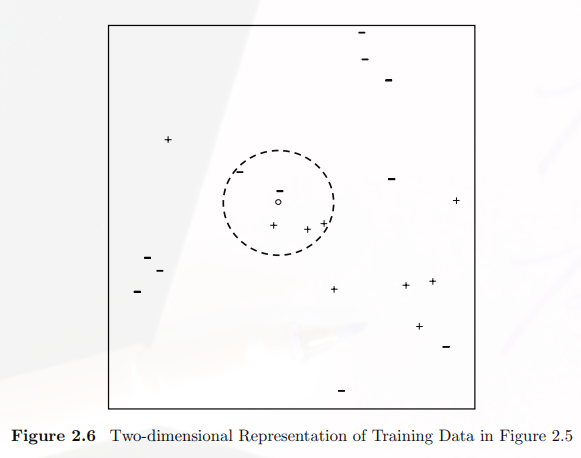
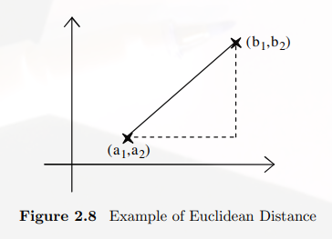
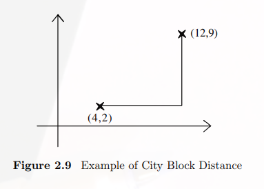
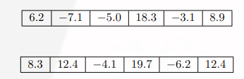
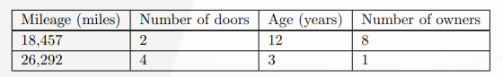

# Nearest Neighbour

簡單來說，knn就是利用每個點與其他的的距離定義要預測的資料屬於什麼類別，k表示為取幾個點來進行比較，所以假設有一個資料集分爲`+`與`-`兩類，進行k=5的knn分類，所以要先找出與預測點比較近的5個點，如果假設找到的點中分別有三個類別爲`+`與兩個類別爲`-`的離這一個預測點比較近，則被分類爲`+`。

 

## 距離公式
因爲這個演算法牽涉到距離公式的計算，所以如何選擇計算距離的公式就變得非常重要

當然要計算距離就必須滿足以下條件：
1. $$dist(A,A)=0$$
2. $$dist(A,B)=dist(B,A)$$
3. $$dist(A,Z) \le dist(A,B)+dist(A,Z)$$

### 歐基里德公式

最簡單的方式就是計算兩個點之間的直線距離

$$\sqrt{(d_{1a}-d_{1b})^2+(d_{2a}-d_{2b})^2+....+(d_{na}-d_{nb})^2} $$
 

### City Block 距離公式

將每個維度的之間的值相加。

$$(d_{1a}-d_{1b})+(d_{2a}-d_{2b})+....+(d_{na}-d_{nb}) $$

 

### Maximun dimesion distance

這種方式是將所有維度的距離算出來，取出最大的一個來進行比較。所以在以下的例子中會取第二維度$$12.4-(-7.1)=19.5$$，來作爲與此點的距離。

 

### Normalize
除了剛剛提到的距離公式之外，標準化也是其中一個要注意的事項，以以下的例子爲例，Mileage這個屬性的資料會大大影響整個距離的結果。

 

所以假設一個數值a

1. 利用$$(a-min)/(max-min)$$的結果來進行標準化。
2. 利用weight的方式，根據不同的屬性分別分配不一樣的權重值，所以如果是Euclidean distance會被轉換成 
$$\sqrt{w_1(d_{1a}-d_{1b})^2+w_2(d_{2a}-d_{2b})^2+....+w_n(d_{na}-d_{nb})^2} $$

### Categorical

利用Knn進行分類，如果遇到Categorical的屬性資料，在進行距離計算時（如果是color的屬性），則red-red=0,red-blue=1,blue-green=1

