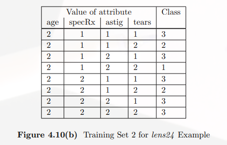

# Using Entropy for Attribute Selection

剛剛提到TDIDT會遇到不知道如果選擇attribute，因此有學者提出使用機率中的Entropy來進行attribute的選擇

## Entropy

$$ E = - \sum_{1}^{K} p_i\log_{2}{p_i}$$

### Entropy比較白話的解釋

可以用以表示資料的混亂程度，如果值越大表示資料越混亂，如果同一個屬性中，一個值出現的機率過低，會增加entropy的值

## ID3演算法進行

在使用Entropy時，會先計算training dataset的$$E_{start}$$，所以假設有k個類別，$$p_i$$爲每個類別在資料集中的機率。

$$ E_{start} = - \sum_{1}^{k} p_i\log_{2}{p_i}$$

接著計算每個attribute的$$E_{new}$$，它的求法爲每個屬性所擁有的值對應到的到每個類別的Entropy的結果進行平均，接著在把這些結果進行加總平均。這裡假設有$$x$$個屬性，每個屬性擁有$$y$$個值，$$p_j$$爲每一個屬性中每個值對應到每個類別的機率。

以下圖情況爲例，在計算age這個屬性時，$$p_j$$分別爲$$p_1=0.125,p_2=0.25,p_3=0.675$$
 

$$E_{new}=-\sum_{i=1}^{y}p_i\sum_{j=1}^{k}p_j\log_{2}{p_j}$$

要將所有attribute的$$E_{new}$$計算出來

最後計算每一個attritube 的Information Gain

$$Information\ Gain=G_i = E_{start}-E_{new_i}$$ （$$E_{new_i}$$有i）

最後比較所有的attritube的Information Gain，最大的則是要進行選擇切割的屬性，然後一直重複以上步驟到整個tree建完爲止。

以上就是ID3演算法

## C4.5

C4.5時ID3的改良，進一步將ID3得到的Information Gain除於Split Information

Split Information的求法爲針對每一個attritube中資料的個數的比率$$\frac{s}{N}$$，也就是說如果有一個attritube，有$$a_1,a_2,a_3$$三個值，分別各有16, 8, 8個instance，則

$$split \ imformation= -\frac{16}{32}\log_{2}{\frac{16}{32}}-\frac{8}{32}\log_{2}{\frac{8}{32}-\frac{8}{32}\log_{2}{\frac{8}{32}}}$$

## CART
Gini Index與Entropy一樣是爲了能過挑出能過進行切割的attritube，進行的步驟也與ID3差不多。

Gini Index被定義爲

$$G=1-\sum_{i=1}^{K}p_i^2$$

$$Gini_{new}$$的計算方式如下：
$$G_j=1-\sum_{i=1}^{k}(f_{ij}/N_j)^2$$

$$Gini_{new}=\sum_{j=1}^{V}G_j\frac{N_j}{N}$$
$$=...=1-\frac{1}{N}\sum_{j=1}^{V}(\frac{1}{N})\sum_{i=1}^{k}f_{ij}^2$$

$$G_{start}$$的計算方式則是每個類別在這個要進行切割的資料集中出現的機率，進行Gini Index的計算，所以說如果有三個類別，在這個資料集的機率分別爲，$$p_1=\frac{4}{24},p_2=\frac{5}{24},p_3=\frac{15}{24}$$，則$$G_{start}=1-\sum_{i=1}^3p_i^2=0.5382$$

