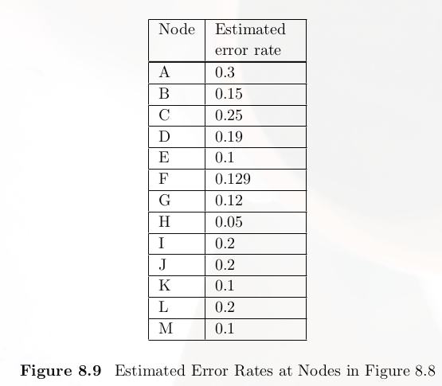
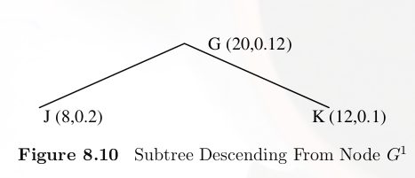

# Decision Tree 的Pruning
[博客參考資料](https://blog.csdn.net/u012328159/article/details/79285214)

在機器學習中，很常會遇到訓練時，模型的結果非常好，結果拿測試資料集去測試的時候，結果卻非常的差，這種現象我們稱爲OverFitting。

在Decision Tree預防結果Overfitting可以使用pruning的方法

再Decision Tree的演算法中，處理OverFitting的情況分爲兩種Pre-pruning與Post-pruning

## Pre-pruning

在Decison Tree建立的過程中，就把盡可能降低Decision Tree分支太多的問題。當然處理的方式有很多，有Size CutOff、Maximun Depth Cutoff。
- Size Cutoff：如果分支出的子集合如果沒有大於Size Cutoff的值就刪除這個分支。
- Maximun Depth Cutoff：規定Decision的長度，如果大於這個長度則刪除。

## Post-pruning

這個方式則是Decision Tree建立完，進行剪枝。在進行這個方法時，必須想將每個分支的error rate記錄下來。如附圖

 

下一層與自己的那一層，會不會因爲多了下一層的規則結果到導致結果變差。如圖所示J、K兩個節點的加權平均爲0.14，比G節點還大，所以應該進行pruning。反之如果比較小則保留。
 

