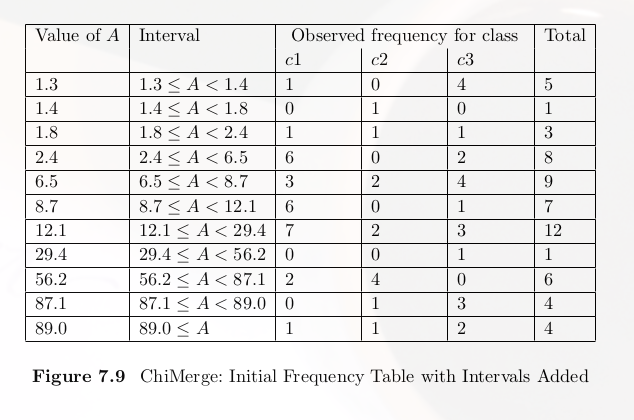
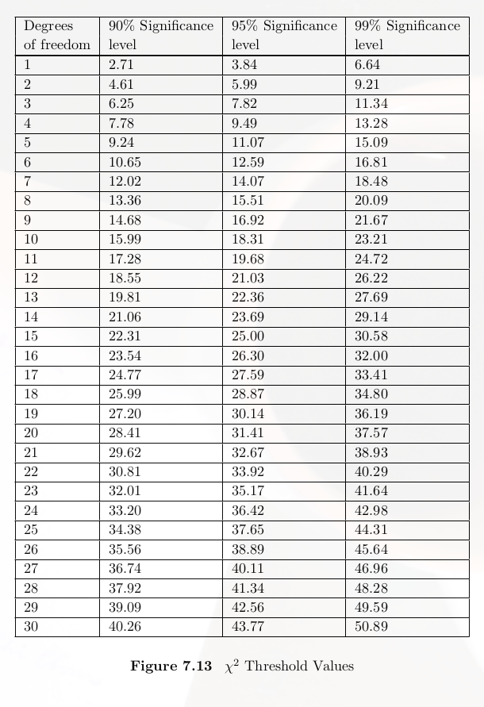

# Discretisation 

在資料探勘中，一定會遇到Continus Attritube，但是有些演算法所有資料都必須爲離散性的資料集，所以Discretisation就是在探討如何將這些continus的資料轉換成離散性的資料集

進行Discretisation的方法很多
- Standard Approach：也就是制定好幾個區間，可以由專家去決定區間怎麼分，然後根據資料的數值進行分類。
- fuzzy Approach：會使用這種方式通常是不知如何定義區間的時候會使用，像是溫度數值，很常會遇到不知如何定義那個區間屬於冷，那個區間屬於熱。
- 等寬方法：每個區間固定長度，像是1~10、11~20、21~30，這樣等距。
- 等頻方法：每個區間都有固定的資料筆數。

## Local discretisation

## Global discretisation

與Local discretisation不同的是，在做演算法前就像將所有的continus的attritube做Discretisation，讓所有資料離散化，在進行演算法計算。

### Chi Merge Alogrithm

[參考網站](https://medium.com/@nithin_rajan/data-discretization-using-chimerge-55c8ade3cfda)

在同一區間中的這個演算法中，每一類之間的頻率，在同一個區間中應該要保持相同，運用到了之前提到的 $$\chi^2$$ ，來檢視兩個區間是否獨立，如果是獨立程度越大則合併，反之如果越小（表示關聯程度大）則應該分開不合併。

在使用這個演算法時，可以先將所有值區間，做成一個frequency table，接著尋找自己的區間與下一個區間倆倆的獨立程度，如果 $$\chi^2$$越小（獨立程度大）則做合併，直到所有區間的$$\chi^2$$大過門檻值則停止。

 

附圖爲演算法停止的$$\chi^2$$門檻值參考表
 

