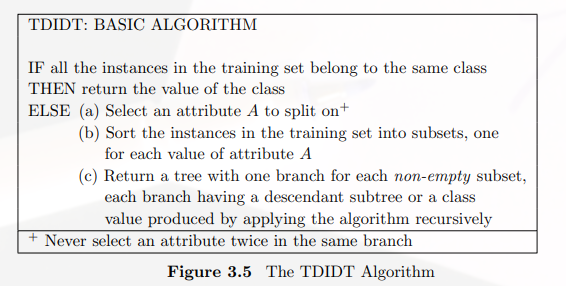

# TDIDT
Decision tree是非常常用的分類技巧，而TDIDT（Top-Down Induction of Decision Tree)就是其中一個演算法，最後也延伸出ID3與C4.5這兩種演算法。

## 規則

 

有一點必須注意的是，使用這個演算法時，不能將在同一個分支中使用相同的attribute兩次以上

## Attribute 的選擇

可以是take-first, take-last 或是random，沒有一定的規則，選擇不同的attritube都會產生出不同的decision tree，衍生出的分支也會有不同的數量，所以這也是這個演算法的缺點。

