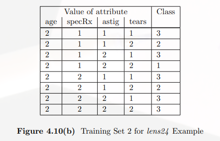
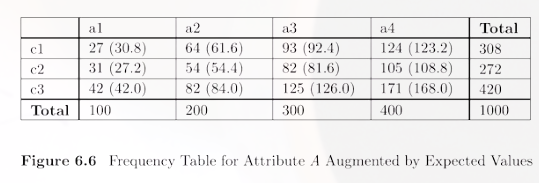
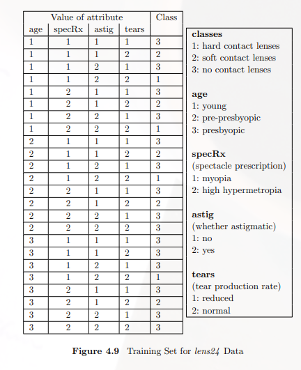
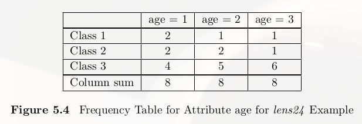

# Decision選擇attribute的方式

剛剛提到TDIDT會遇到不知道如果選擇attribute，因此有學者提出使用機率中的Entropy來進行attritube的選擇，也可以使用 $$\chi^2$$ 作爲attritube選擇的依據

## Entropy

$$E = - \sum_{1}^{K} p_i\log_{2}{p_i}$$

### Entropy比較白話的解釋

可以用以表示資料的混亂程度，如果值越大表示資料越混亂，如果同一個屬性中，一個值出現的機率過低，會增加entropy的值

## ID3演算法進行

在使用Entropy時，會先計算training dataset的$$E_{start}$$，所以假設有k個類別，$$p_i$$爲每個類別在資料集中的機率。可以說明class之間的分佈情況，值越大說明了分佈越平均。譬如說class有兩類，各佔有 $$\frac{1}{2}$$ ，則 $$E_{start}=1$$

$$E_{start} = - \sum_{1}^{k} p_i\log_{2}{p_i}$$

接著計算每個attribute的$$E_{new}$$，它的求法爲每個屬性所擁有的值對應到的到每個類別的Entropy的結果進行平均，接著在把這些結果進行加總平均。這裡假設有$$x$$個屬性，每個屬性擁有$$y$$個值，$$p_j$$爲每一個屬性中每個值對應到每個類別的機率。

以下圖情況爲例，在計算age這個屬性時，$$p_j$$分別爲$$p_1=0.125,p_2=0.25,p_3=0.675$$ 

$$E_{new}=-\sum_{i=1}^{y}p_i\sum_{j=1}^{k}p_j\log_{2}{p_j}$$

要將所有attribute的$$E_{new}$$計算出來

最後計算每一個attribute 的Information Gain

$$Information\ Gain=G_i = E_{start}-E_{new_i}$$ （$$E_{new_i}$$有i）

最後比較所有的attribute的Information Gain，最大的則是要進行選擇切割的屬性，然後一直重複以上步驟到整個tree建完爲止。

以上就是ID3演算法

## C4.5

C4.5是ID3的改良，進一步將ID3得到的Information Gain除於Split Information

Split Information的求法爲針對每一個attribute中資料的個數的比率$$\frac{s}{N}$$，也就是說如果有一個attritube，有$$a_1,a_2,a_3$$三個值，分別各有16, 8, 8個instance，則

$$split \ imformation= -\frac{16}{32}\log_{2}{\frac{16}{32}}-\frac{8}{32}\log_{2}{\frac{8}{32}-\frac{8}{32}\log_{2}{\frac{8}{32}}}$$

## CART

Gini Index與Entropy一樣是爲了能過挑出能過進行切割的attribute，進行的步驟也與ID3差不多。

Gini Index被定義爲

$$G=1-\sum_{i=1}^{K}p_i^2$$

$$Gini_{new}$$的計算方式如下： $$G_j=1-\sum_{i=1}^{k}(f_{ij}/N_j)^2$$

$$Gini_{new}=\sum_{j=1}^{V}G_j\frac{N_j}{N}$$ $$=...=1-\frac{1}{N}\sum_{j=1}^{V}(\frac{1}{N})\sum_{i=1}^{k}f_{ij}^2$$

$$G_{start}$$的計算方式則是每個類別在這個要進行切割的資料集中出現的機率，進行Gini Index的計算，所以說如果有三個類別，在這個資料集的機率分別爲，$$p_1=\frac{4}{24},p_2=\frac{5}{24},p_3=\frac{15}{24}$$，則$$G_{start}=1-\sum_{i=1}^3p_i^2=0.5382$$

## 使用$$\chi^2$$選擇attribute

[ $$\chi^2$$的說明 ](https://www.yongxi-stat.com/chi-squared-test-of-independence/)

還有另一種選擇attribute的方式是使用$$\chi^2$$，它表示觀察值 $$O$$ 與理論值 $$E$$ 之間的偏離程度，因此它的算法爲所有attritube的所有元素對應到class中$$(O-E)^2/E$$的和，觀察值與理論值的差異總和越大，則表示兩變數間越有關聯性。可以將條件機率的概念代入會比較了解卡方檢驗所代表的關聯性問題。

$$\chi^2=\sum_{i=1}^{V}\sum_{j=1}^{K}(O_{ij}-E_{ij})^2/E_{ij}$$

其中

$$E_{ij}=c_i*a_j/a_{sum}$$

$$E_{11}=c_1*a_1/a_{sum}=308*100/1000$$

所以以上述的例子中，結果爲

$$\chi^2=(27-30.8)^2/30.8-(64-61.6)^2/61.6-...-(171-168)^2/168=1.35$$

最後將資料集中所有的attribute都做一邊找出最大的就是要選擇的，表示這個Attritube與Class之間的關係越相關。

## 技巧

在做entropy與Gini Index的計算時，可以使用frequency table增加計算的方便性，也能簡化式子的運算。由以下的例子說明，可以做成第二張圖那樣，有了這個表格 $$E_{new}$$ 就可以進一步進行簡化( $$N=24,\ K=3$$ 以以下的例子說明)：

$$V$$爲class的個數:

$$\sum_{j=1}^V=N$$

$$E_{new}$$ 的式子可以簡化成：

$$E_{new}=-\sum_{i=1}^{y}p_i\sum_{j=1}^{k}p_j\log_{2}{p_j}=...=-\sum_{j=1}^V\sum_{i=1}^{K}\frac{f_{ij}}{N}\log_{2}{f_{ij}}+\sum_{j=1}^V\frac{N_j}{N}\log_{2}{N_j}$$

 

所以以age的這個attribute這個爲例，它的 $$E_{new}$$ 爲：

$$(-2\log_{2}2-1\log_{2}1-1\log_{2}1-2\log_{2}2-2\log_{2}2-1\log_{2}1-4\log_{2}4-5\log_{2}5-6\log_{2}6$$

$$+8\log_{2}8+8\log_{2}8+8\log_{2}8)/24=1.2867$$

從這個例子中可以看到frequency table 的重要性與方便性，在遇到numerical Attribute 時轉換成nominal Attribute 也能利用這個方式快速計算Information Gain
