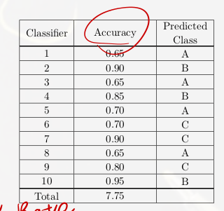
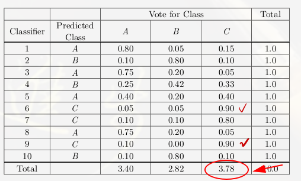

# Ensemble Decision Tree

如果只使用單一一個Decision Tree效果常常不盡理想，所以就有學者提出，將一個Dataset做出多個Decision Tree，最後再將它們結合進行預測。這樣的做法可以有效的避免Overfitting的發生。而這個就是著名的 __Random Forest__ 演算法。

## Random Forest

[參考網站](https://www.ycc.idv.tw/ml-course-techniques_4.html)

Random Forest是基於CART這個演算法做出許多不一樣的Tree出來，最後在做結合。

### Bagging

在Random Forest中，Bagging是一個重要的環節。Bagging是將原本的資料集 $$D$$ 做許多n個小資料集 $$\hat{D_1},\hat{D_2},\hat{D_3}....\hat{D_n}$$，接著利用這些小資料集訓練成n個模型 $$g_t$$ ，集合成一個最終模型。此外Bagging可以減少「變異量」，使得模型不易overfitting。

此外因為做了Bagging，所以有一些沒被用到dataset，可以用做模型的驗證模型的好壞。這個稱為out-of-bag。

### 選擇分類結果

前面提到Random Forest是用很多的Decision Tree建立出來的，如何選擇這些多個Decision Tree的分類結果也是個問題。

- majorty vote：選擇所有Decision Tree中分類結果最多的那個。
- Weight majority vote：每個Decision Tree做完後，根據不同的Decision Tree所預測出不同的分類結果的準確率進行加總，找出最大的那個，如下表，有六個分類器，可以看到B的預測結果三者之中最高，所以會最後會被分類為B。

 

A = 0.65 + 0.65 + 0.7 + 0.65 = 2.65
B = 0.9 + 0.85 + 0.95 = 2.7
C = 0.7 + 0.9 + 0.8 = 2.4

- Track Record：另一種是將所有的Decision Tree的預測每個類的準確率記錄下來，最後選擇最高的那個。

 

