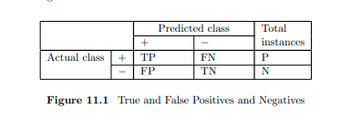
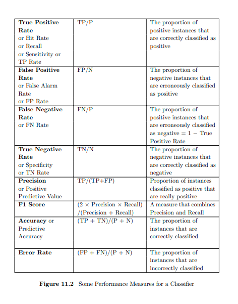
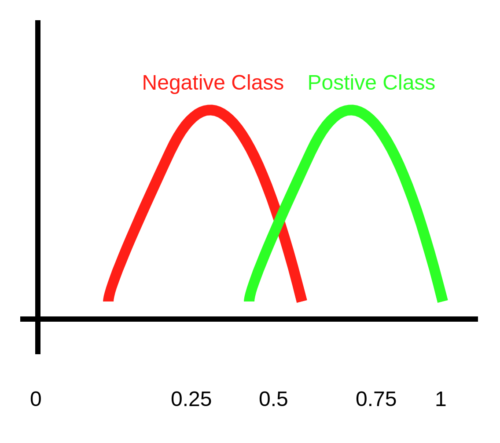
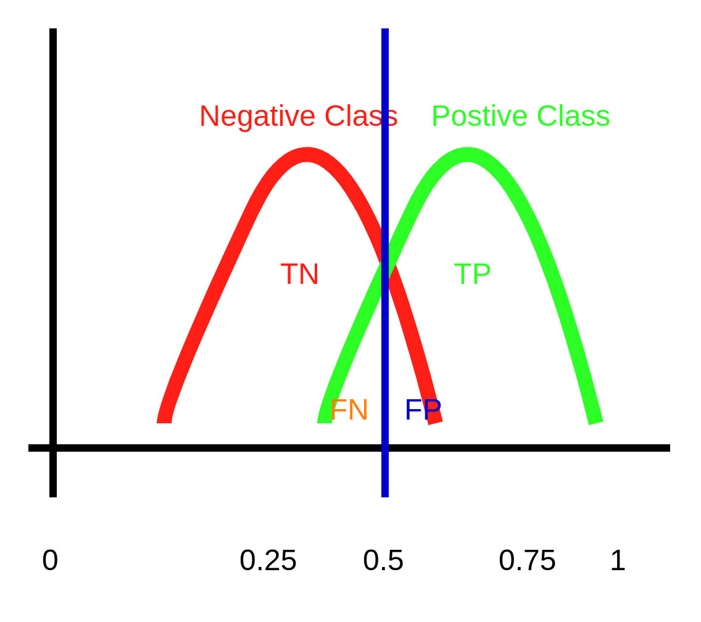
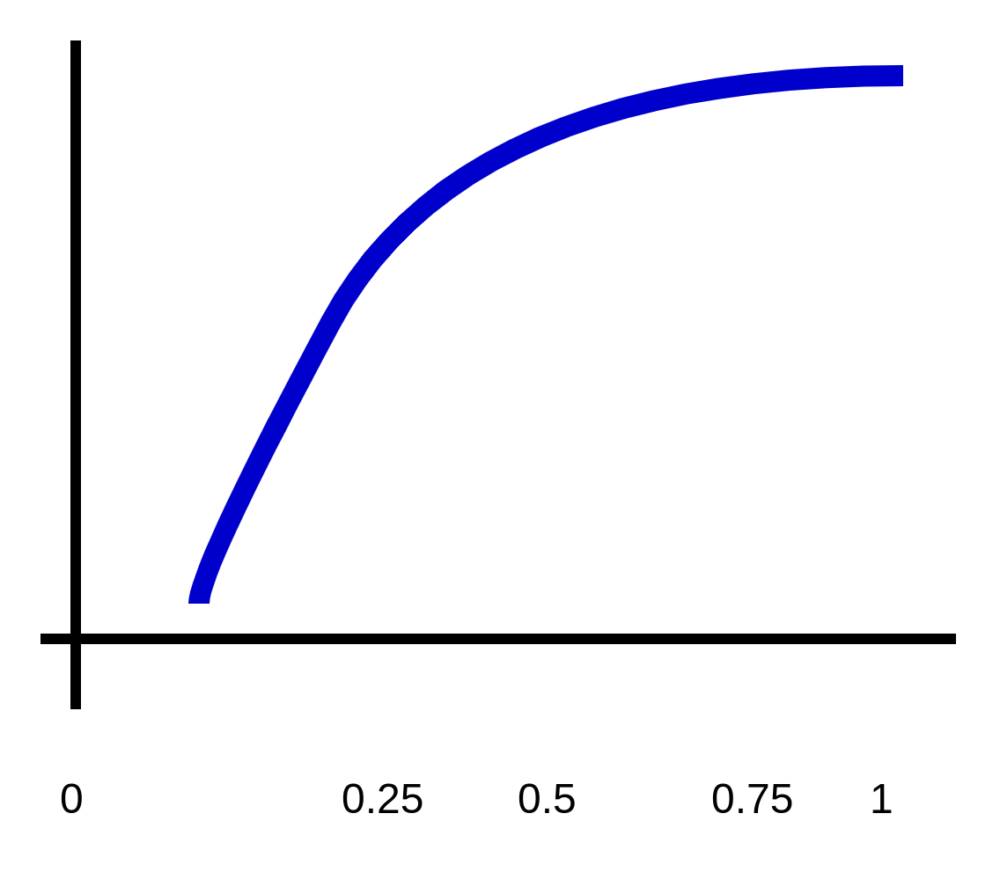
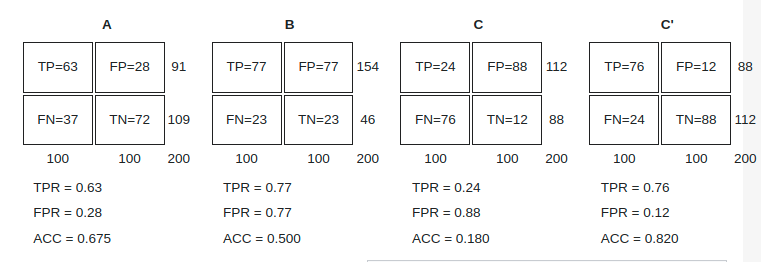
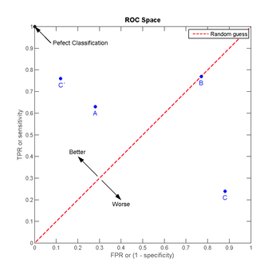

# 測量Classifer的表現

## True and False Positives and Negatives

當Classifier訓練完，常會使用Confusion Matrix，將Test Dataset在此模型的表現記錄下來。

 

## 一些常用的測量方法

 

## ROC 曲線

[參考資料](https://towardsdatascience.com/finding-donors-classification-project-with-pyspark-485fb3c94e5e)

如果有一個二元分類器的結果如下圖，紅色為負樣本的分佈，綠色為正樣本的分佈

 

下圖中藍色的線為閥值，在它左邊會被視為負樣本，其右邊會視為正樣本。所以可以看到TN、FN、FP與TP的區域。

 

而ROC曲線就是針對這個分類器根據這個閥值移動，所得到不同的結果來畫出ROC曲線。當曲線下的面積小於0.5表示此分類器效果不好。

 

## ROC圖

[維基百科](https://zh.wikipedia.org/wiki/ROC%E6%9B%B2%E7%BA%BF)

當然，也可以給定一個固定的閥值，針對不同的分類器所得到的結果畫在ROC圖上，用以判斷不同分類的效果。離左上角越近，代表準確率越好。此外，從圖中可以看到，點C在紅色虛線下，則表示預測準確率最低；點B在虛線上，表示準確率為50%。

 

 

